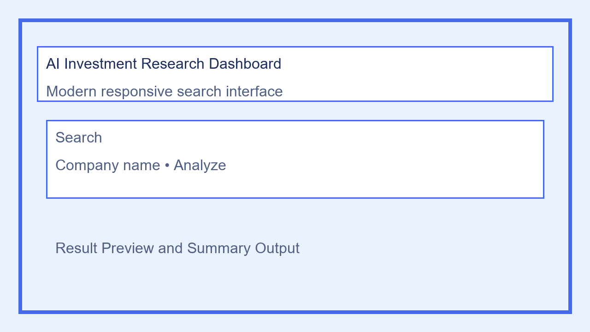
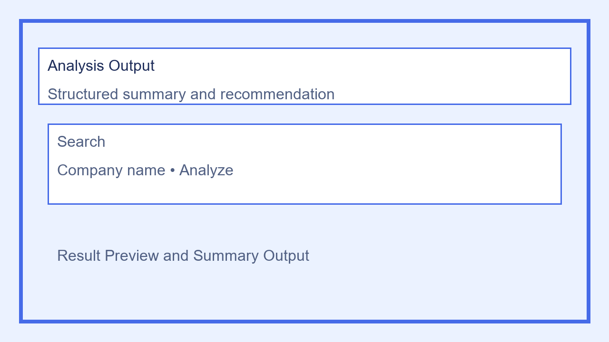
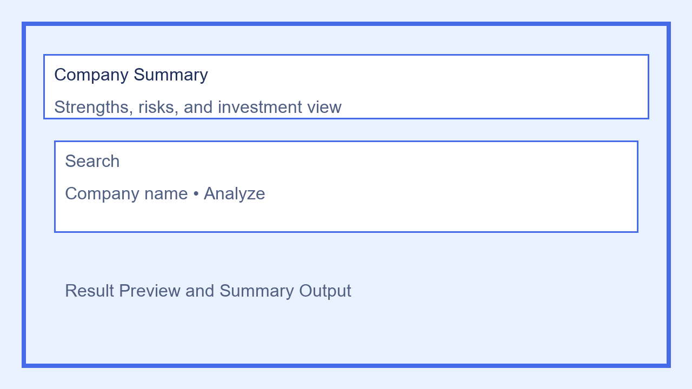

# AI Investment Research Agent

A polished internship-ready investment research dashboard built with React, Vite, and Node.js. The app provides a clean search experience for company screening and investment insight generation.

## Overview

AI Investment Research Agent is a lightweight web application that lets users enter a company name and receive a structured investment summary, strengths, risks, and a recommendation. The frontend is built with React and Vite, while the backend uses Express and a simple workflow for company profile lookup and formatting.

## Features

- Responsive React dashboard with search and cards
- Investment research summary output
- Preloaded company profiles for instant analysis
- Structured backend API with clear request/response flow
- Lightweight, internship-friendly codebase
- Ready for further AI integration

## Tech Stack

- Frontend: React, Vite, Axios
- Backend: Node.js, Express, dotenv, CORS
- Workflow: modular route/service architecture

## Folder Structure

```text
ai-investment-agent/
├── backend/
│   ├── routes/
│   │   └── analyze.js
│   ├── services/
│   │   └── geminiService.js
│   ├── langgraphAgent.js
│   ├── server.js
│   ├── package.json
│   └── .env.example
├── frontend/
│   ├── public/
│   ├── src/
│   │   ├── App.css
│   │   ├── App.jsx
│   │   ├── index.css
│   │   └── main.jsx
│   ├── package.json
│   └── index.html
├── screenshots/
│   └── .gitkeep
├── .gitignore
└── README.md
```

## Getting Started

### Prerequisites

- Node.js 18+ installed
- npm installed

### Setup

1. Clone the repository:
   ```bash
   git clone https://github.com/Nagathulasi01/ai-investment-research-agent.git
   cd ai-investment-research-agent
   ```
2. Install backend dependencies:
   ```bash
   cd backend
   npm install
   ```
3. Install frontend dependencies:
   ```bash
   cd ../frontend
   npm install
   ```
4. Create a `.env` file from the example:
   ```bash
   cd ../backend
   cp .env.example .env
   ```
5. Start backend and frontend servers in separate terminals.

### Run the backend

```bash
cd backend
npm run dev
```

### Run the frontend

```bash
cd frontend
npm run dev
```

Open the frontend in your browser at the URL shown by Vite, usually `http://localhost:5173`.

## Environment Variables

The backend loads environment variables from `.env`. Example values are defined in `.env.example`.

```env
PORT=5000
GEMINI_API_KEY=
```

## API Endpoint

- `POST /api/analyze`

### Request body

```json
{
  "company": "Tesla"
}
```

### Response body

```json
{
  "success": true,
  "analysis": "...formatted investment report..."
}
```

## Example Output

```text
==============================
COMPANY: Amazon
==============================

?? COMPANY SUMMARY
Amazon is a global leader in e-commerce and cloud computing.

--------------------------------
? STRENGTHS
- Strong AWS growth
- Massive customer base
- Global logistics network

--------------------------------
?? RISKS
- High operational costs
- Regulatory scrutiny

--------------------------------
?? INVESTMENT DECISION
INVEST

==============================
```

## Screenshots

The following application screenshots are included in the `screenshots/` folder.







## Future Improvements

- Add real Gemini or OpenAI API integration
- Replace hardcoded profiles with dynamic data sources
- Add saved history and user authentication
- Add charts, trend visualizations, and analytics
- Deploy using Docker, Vercel, or a cloud provider

## Deployment

1. Build the frontend:
   ```bash
   cd frontend
   npm run build
   ```
2. Copy the build output to your production server or serve via backend.
3. Start the backend in production mode:
   ```bash
   cd backend
   npm start
   ```
4. Configure `PORT` and any production environment variables.

### ZIP Submission

For internship submission, archive the repository folder excluding `node_modules` and `.env`. The repository is clean and ready for export as a ZIP file.
